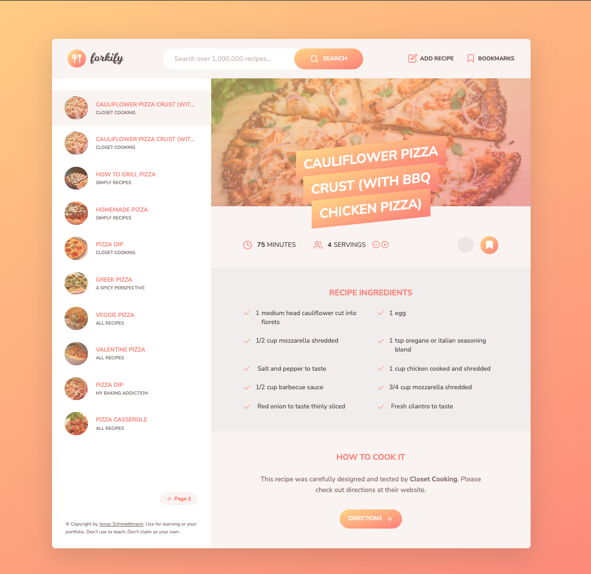

# Forkify App 🍽️

The Forkify app is a project developed in Jonas Schmedtmann’s course, focusing on building a Recipe App with modern JavaScript techniques. This app showcases various concepts and tools to create a functional and interactive web application. 



## Key Features

- **Recipe Search**: Users can search for recipes using a search bar. The app uses a third-party API to fetch recipe data.
- **Recipe Details**: Once a recipe is selected, users can view detailed information, including ingredients and cooking instructions.
- **Responsive Design**: The app is designed to work on both desktop and mobile devices, ensuring a smooth user experience across different screen sizes.
- **Add to Favorites**: Users can save their favorite recipes for easy access later.
- **Pagination**: Recipes are paginated to enhance performance and usability.

## Flow Structure
 


## Technologies Used

- **HTML/CSS**: For structuring and styling the application.
- **JavaScript**: For dynamic functionality and interaction with the API.
- **API Integration**: The app uses the Forkify API (or a similar recipe API) to fetch and display recipe data.
- **Webpack**: For bundling and optimizing the application's resources.
- **Babel**: For ensuring compatibility with older browsers by transpiling modern JavaScript code.
- **SASS**: For advanced CSS styling with variables, nesting, and mixins.
- **ESLint**: For maintaining code quality and consistency.
- **Prettier**: For automatic code formatting.
- **Parcel**: An alternative to Webpack, providing a zero-config bundler for faster builds and development.
- **Jest**: For writing and running unit tests to ensure code reliability and correctness.
- **Axios**: For making HTTP requests to the API, providing an easy-to-use alternative to the native `fetch` API.

## Learning Objectives

- **Asynchronous JavaScript**: Learn how to handle asynchronous operations using `async`/`await` and Promises.
- **Modular JavaScript**: Understand how to break down code into reusable modules.
- **API Handling**: Gain experience in fetching and handling data from external APIs.
- **State Management**: Manage the application's state effectively to update the UI based on user interactions.
- **Testing**: Learn how to write unit tests to verify code functionality and maintain code quality.
- **Build Tools**: Familiarize yourself with build tools and bundlers like Webpack, Parcel, and Babel.

## Getting Started

1. **Clone the Repository**: 

    ```bash
    git clone https://github.com/yourusername/forkify-app.git
    ```

2. **Navigate to the Project Directory**: 

    ```bash
    cd forkify-app
    ```

3. **Install Dependencies**: 

    ```bash
    npm install
    ```

4. **Start the Development Server**: 

    ```bash
    npm start
    ```

5. **Open Your Browser**: Visit `http://localhost:3000` to view the app.

## Contributing

Contributions to the Forkify app are welcome! If you have suggestions or improvements, please create a pull request or open an issue.

## License

This project is licensed under the MIT License. See the [LICENSE](LICENSE) file for details.

---

For more details and to see the full course, check out Jonas Schmedtmann’s course on [Udemy](https://www.udemy.com/course/advanced-css-and-sass/).
